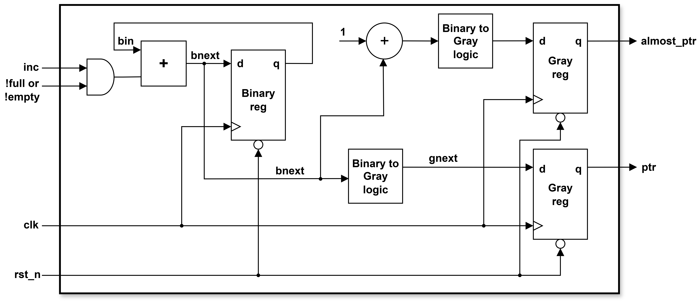
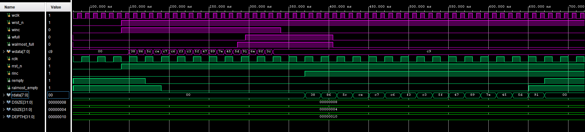

# Asynchronous-FIFO-Design
This repository contains the verilog implementation of Asynchronous FIFO

### Top level block diagarm of Asynchronous FIFO:

### Gray counter: 

### Synchronizers for afull_n/aalmost_full_n and aempty_n/aempty_full_n signals: 

## Simulation Results
### Test case 1:
Write data and read it back

### Test case 2:
Write data to make FIFO full and try to write more data

### Test case 3:
Read data from empty FIFO and try to read more data

### Test case 4:
Write 2 data and read 1 data

### Test case 5:
Write until fifo become full and then read until fifo become empty

## References
1. [Sunburst Design: Simulation and Synthesis Techniques for Asynchronous FIFO Design with Asynchronous Pointer Comparisons](http://www.sunburst-design.com/papers/CummingsSNUG2002SJ_FIFO2.pdf)
2. [Sunburst Design: Simulation and Synthesis Techniques for Asynchronous FIFO Design](http://www.sunburst-design.com/papers/CummingsSNUG2002SJ_FIFO1.pdf)
